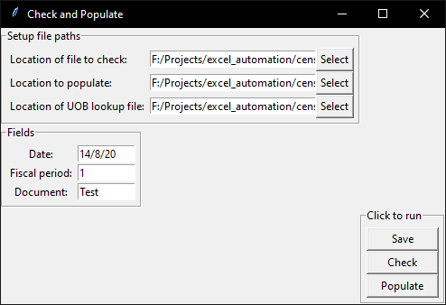

Template code to check all values in an excel file and populate another excel file with the correct values.

How to use:

1. Clone repository
2. Generate the UOB branch codes using pdf_to_csv/pdf_to_csv.ipynb if not already done
3. Run app.pyw
4. Locate file to check, file to populate and the UOB branch code reference files in the GUI.
   
5. Change the fields in the GUI to fit your needs.
6. Click save
7. Click Check
8. Click Populate
